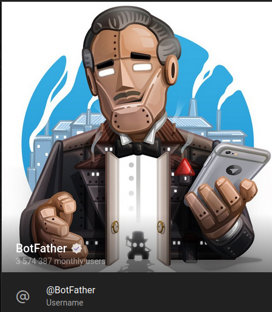
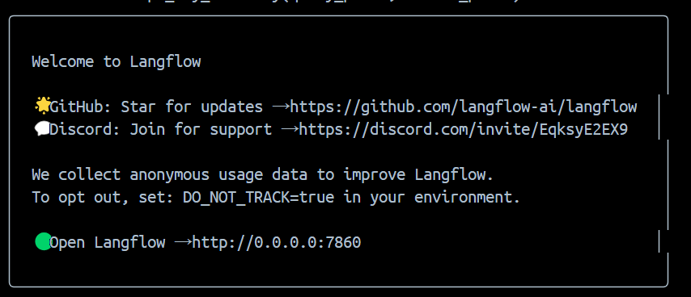
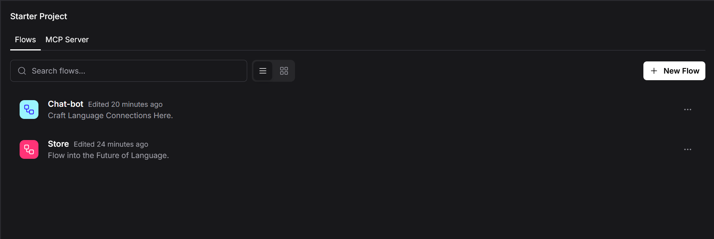

# Langflow

## Для запуска

Для начала нужно создать ботa:  
## шаг 1
Зайти в телеграм и перейти в BotFather  

## шаг2
Создать бота (пример на рисунке)  

## шаг3
Указать настройки окружения в *.env* файле.
```
BOT_TOKEN - токен бота
OLLAMA_LLM - основная модель
OLLAMA_EMBEDDING_MODEL - модель для эмбединга
CHROMA_DIR - директория для векторной бд
```
## шаг4
```bash
docker compose up -d --build
```

## P.S.
Первый запуск может идти долго, так как скачиваются все зависимости и после 
сборки контейнеров скачиваются модели для Ollama. 
Лучше выделить 10+ гб оперативной памяти в ресурсах докера. 

Также надо подождать пока langflow поднимется, процесс подключения к langflow можно отслеживать в контейнере chat-bot


## Использование
После успешной установки и запуска видим в контейнере langflow следующее:



Переходим по ссылке на http://0.0.0.0:7860 и видим главную страницу.
На главной странице можем видеть уже загруженные flows.



Значит все flows успешно загружены и можно их вызывать через телеграмм бота.
На текстовое сообщение в тг происходит вызов цепи Chat-bot, а на файл вызов Store.

